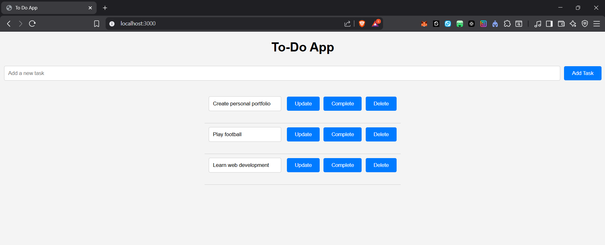
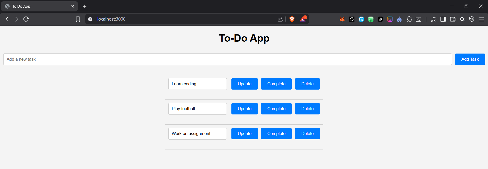
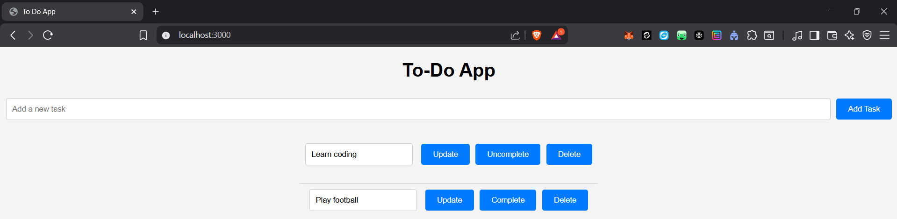
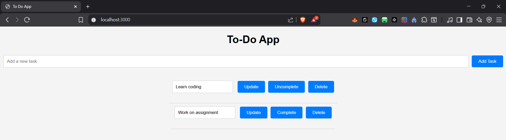

## To-Do Application project using ExpressJs With MongoDB
This is a tutorial on using MongoDB as database for the creation of "To-Do tasks" as shown below. The tasks can be updated, completed and even be deleted. 

## Updating Tasks 
Example of updating task. In this updation, I updated the first and last tasks to "Learn coding" and "Work on assignment" respectively. 

## Completion of Tasks
When a task is being completed, click on the complete button to show it is completed like the example below:

## Deletion of Tasks
Now, let us try deleting a task by clicking on the delete button. 

As expected, the "play football" task was deleted. 